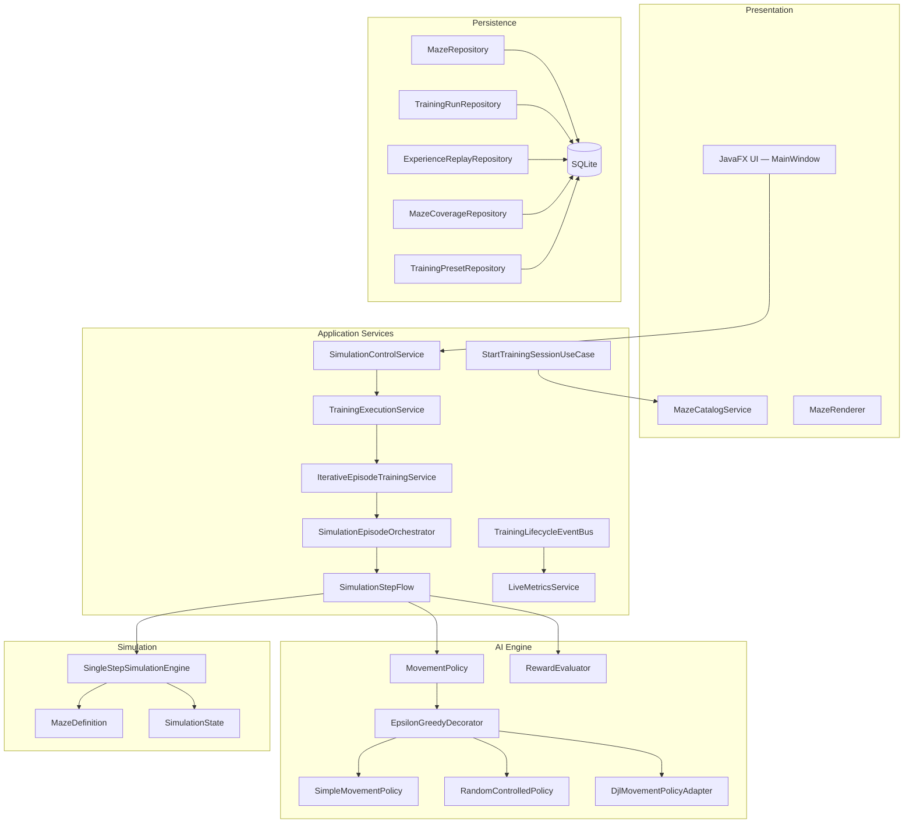
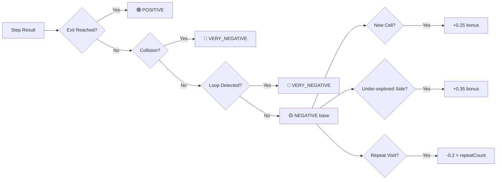
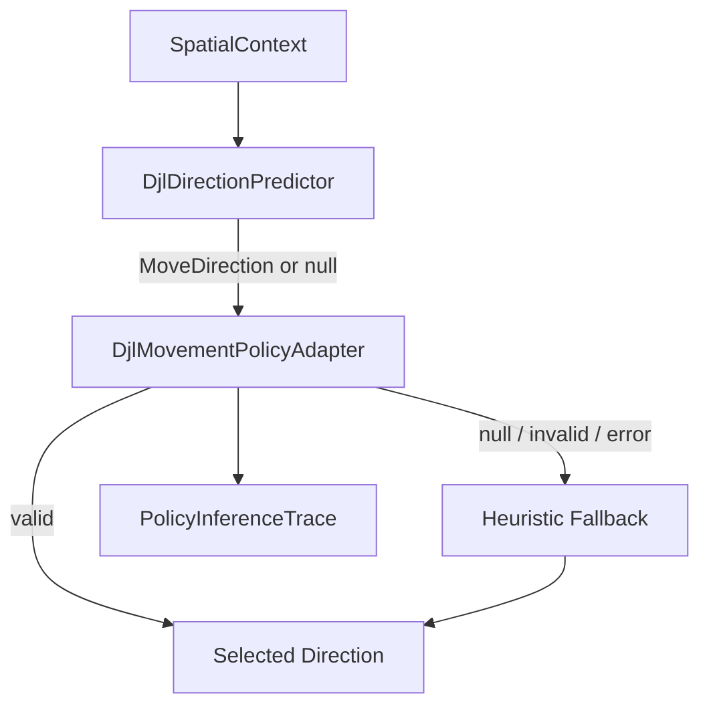
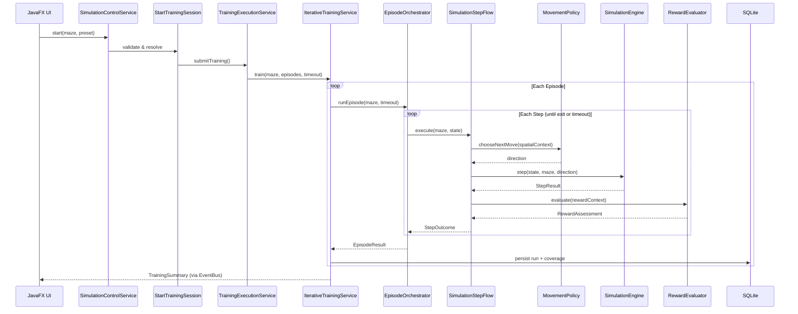
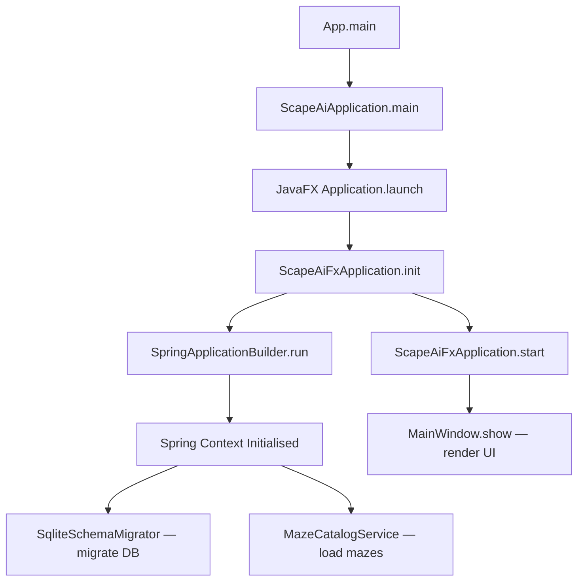
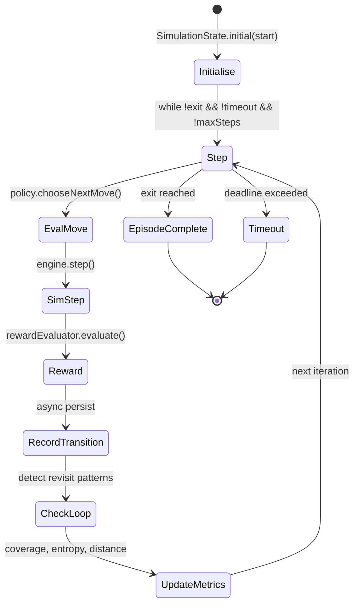
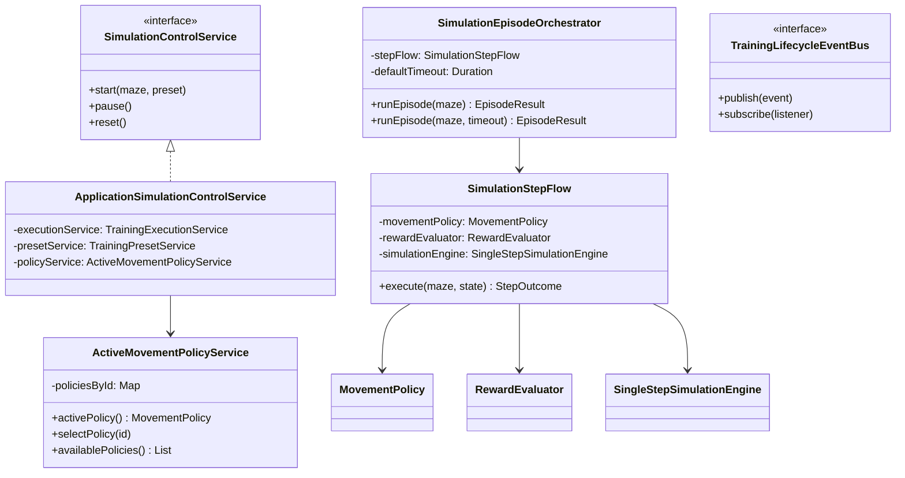
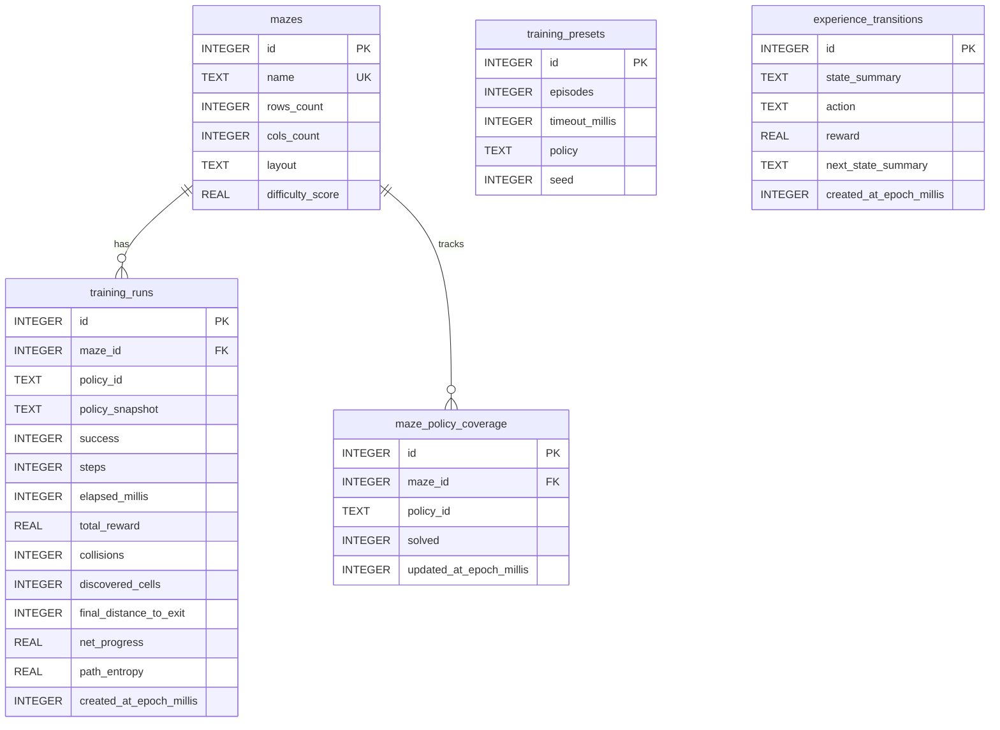

# Scape AI

> A Java-based reinforcement-learning agent that learns to escape 2D mazes through iterative training, powered by Spring Boot and visualised in real time with JavaFX.


---

## Table of Contents

1. [Overview](#overview)
2. [Architecture](#architecture)
3. [AI Engine — Algorithms & Strategies](#ai-engine--algorithms--strategies)
   - [Movement Policies](#movement-policies)
   - [Epsilon-Greedy Exploration](#epsilon-greedy-exploration)
   - [Reward System](#reward-system)
   - [Spatial Context](#spatial-context)
   - [DJL Integration (Deep Java Library)](#djl-integration-deep-java-library)
4. [Training Pipeline](#training-pipeline)
5. [Software Flow & Key Classes](#software-flow--key-classes)
   - [Bootstrap Sequence](#bootstrap-sequence)
   - [Episode Execution Flow](#episode-execution-flow)
   - [Class Diagrams](#class-diagrams)
6. [Persistence Layer](#persistence-layer)
7. [User Interface](#user-interface)
8. [Configuration](#configuration)
9. [Getting Started](#getting-started)
10. [Project Structure](#project-structure)

---

## Overview

Scape AI simulates an agent navigating a neon-styled 2D labyrinth. Each training session consists of hundreds or thousands of episodes where the agent:

1. Receives spatial context about the maze, its position, and exploration history
2. Selects a movement direction via a configurable policy
3. Receives reinforcement feedback (rewards/penalties)
4. Accumulates experience transitions for future replay

The system persists all training metrics, model parameters, and maze definitions in a local SQLite database, so learning is **cumulative across application restarts**.

---

## Architecture



---

## AI Engine — Algorithms & Strategies

### Movement Policies

The AI engine uses a **strategy pattern** with interchangeable movement policies registered as Spring beans:

| Policy ID | Class | Algorithm |
|---|---|---|
| `heuristic-baseline` | `SimpleMovementPolicy` | Scored heuristic with exit-proximity, anti-backtrack, coverage potential, and stagnation detection |
| `random-controlled` | `RandomControlledMovementPolicy` | Uniform random selection over valid (non-wall) moves with a seedable PRNG |
| `djl-adapter` | `DjlMovementPolicyAdapter` | Deep Java Library adapter for neural-network-based direction prediction with heuristic fallback |

Users can switch policies at runtime through the UI or via `ActiveMovementPolicyService`.

#### Heuristic Baseline — `SimpleMovementPolicy`

The default policy scores each valid move based on multiple factors:

```
score(direction) = w_dist × distanceToExit
                 + w_visit × unvisitedBonus
                 + w_back × antiBacktrackPenalty
                 + w_coverage × coveragePotential
```

Key behaviours:
- **Exit-proximity**: moves that reduce Manhattan distance to the exit are strongly favoured
- **Unvisited bonus**: prefers cells not yet explored, weighted by recency window
- **Anti-backtrack**: penalises revisiting the most recent `N` positions (default `N = 6`)
- **Stagnation detection**: when all neighbours are visited, switches to coverage-potential scoring to break out of loops

#### Random Controlled — `RandomControlledMovementPolicy`

Selects uniformly at random from all valid (non-wall, in-bounds) moves. The PRNG is seeded via `SessionRandomSource` (default seed: `20260309`), ensuring **reproducible training runs** when needed.

#### DJL Adapter — `DjlMovementPolicyAdapter`

An adapter layer for integrating trained neural networks via [Deep Java Library (DJL)](https://djl.ai/). It:

1. Builds a `SpatialContext` and passes it to a `DjlDirectionPredictor`
2. Validates the predicted direction (non-null, in-bounds, non-wall)
3. Falls back to the heuristic baseline on null, invalid, or exception results
4. Records an `PolicyInferenceTrace` per call with latency, confidence, and fallback reason

Currently the predictor is a **placeholder stub** (`context -> null`), designed to be replaced with a trained model.

### Epsilon-Greedy Exploration

All policies are wrapped in an `EpsilonGreedyMovementPolicyDecorator`:

```
with probability ε → pick a random valid move   (exploration)
with probability 1-ε → delegate to base policy  (exploitation)
```

- Default **ε = 0.15** (configurable via `scape.ai.epsilon`)
- Tracks per-episode `explorationCount` / `exploitationCount`
- Propagates `InferenceTraceProvider` from the wrapped policy

This ensures the agent **explores** novel paths even when the base policy has strong preferences.

### Reward System

The `DefaultRewardEvaluator` assigns multi-signal reinforcement feedback:



**Reward signals** (`RewardSignal` enum):

| Signal | Meaning |
|---|---|
| `POSITIVE` | Agent reached the exit |
| `NEGATIVE` | Neutral/suboptimal move |
| `VERY_NEGATIVE` | Collision with wall or revisiting loop |

**Reward shaping** modifiers applied on top of the base signal:
- **+0.25** for discovering a previously unvisited cell
- **+0.35** for moving toward an under-explored side of the maze (L/R coverage imbalance)
- **−0.2 × repeatCount** for revisiting already-visited positions

### Spatial Context

Each decision is informed by `SpatialContext`, a record containing:

- The full `MazeDefinition` (walls, dimensions, exit position)
- The current `SimulationState` (agent position, visited cells set, invalid attempts, exit flag)

The context also exposes derived information:
- **Neighbourhood analysis** via `NeighbourhoodType` (open, corridor, junction, dead-end)
- **Exit-relative quadrant and side** for coverage-aware scoring

### DJL Integration (Deep Java Library)

The project is designed around [DJL](https://djl.ai/) as the primary deep learning framework for future model integration:



The `DjlDirectionPredictor` functional interface accepts a `SpatialContext` and returns a `MoveDirection`. This abstraction allows plugging in:
- A trained PyTorch model loaded via DJL
- A TensorFlow SavedModel
- Any custom predictor

The adapter records detailed inference traces including latency, confidence score, and fallback reason for debugging and analysis.

---

## Training Pipeline



### Episode Metrics Collected

Each episode records **18+ metrics** including:

| Metric | Description |
|---|---|
| `steps` | Total moves attempted |
| `totalReward` | Cumulative reward across all steps |
| `collisions` | Number of wall hits |
| `loopEvents` | Times the agent revisited recent positions |
| `netProgress` | Net distance improvement toward the exit |
| `q1–q4Coverage` | Percentage of cells explored per maze quadrant |
| `leftCoverage` / `rightCoverage` | L/R side exploration balance |
| `pathEntropy` | Shannon entropy of direction choices |
| `explorationCount` / `exploitationCount` | Epsilon-greedy decision breakdown |

---

## Software Flow & Key Classes

### Bootstrap Sequence



### Episode Execution Flow

The core training loop lives in `SimulationEpisodeOrchestrator`:



### Class Diagrams

#### AI Engine

```mermaid
classDiagram
    class MovementPolicy {
        <<interface>>
        +chooseNextMove(SpatialContext) MoveDirection
    }

    class SimpleMovementPolicy {
        -recentHistorySize: int
        +chooseNextMove(SpatialContext) MoveDirection
    }

    class RandomControlledMovementPolicy {
        -randomSupplier: Supplier~Random~
        +chooseNextMove(SpatialContext) MoveDirection
    }

    class DjlMovementPolicyAdapter {
        -predictor: DjlDirectionPredictor
        -fallbackPolicy: MovementPolicy
        +chooseNextMove(SpatialContext) MoveDirection
        +latestInferenceTrace() Optional~PolicyInferenceTrace~
    }

    class EpsilonGreedyMovementPolicyDecorator {
        -delegate: MovementPolicy
        -epsilon: double
        -explorationCount: int
        -exploitationCount: int
        +chooseNextMove(SpatialContext) MoveDirection
    }

    class RewardEvaluator {
        <<interface>>
        +evaluate(RewardContext) RewardAssessment
    }

    class DefaultRewardEvaluator {
        +evaluate(RewardContext) RewardAssessment
    }

    class InferenceTraceProvider {
        <<interface>>
        +latestInferenceTrace() Optional~PolicyInferenceTrace~
    }

    MovementPolicy <|.. SimpleMovementPolicy
    MovementPolicy <|.. RandomControlledMovementPolicy
    MovementPolicy <|.. DjlMovementPolicyAdapter
    MovementPolicy <|.. EpsilonGreedyMovementPolicyDecorator
    EpsilonGreedyMovementPolicyDecorator --> MovementPolicy : wraps
    DjlMovementPolicyAdapter --> MovementPolicy : fallback
    RewardEvaluator <|.. DefaultRewardEvaluator
    InferenceTraceProvider <|.. DjlMovementPolicyAdapter
    InferenceTraceProvider <|.. EpsilonGreedyMovementPolicyDecorator
```



#### Application Layer



---

## Persistence Layer

All data is stored in a local **SQLite** database (`scapeai.db`) with automatic schema migration via `SqliteSchemaMigrator`.

### Database Schema



---

## User Interface

The JavaFX interface follows a **cyberpunk neon control console** aesthetic:

- **Header HUD** — Application title, status indicators
- **Control Panel** — Algorithm selector, preset picker, speed slider, difficulty filter, Start/Pause/Reset buttons
- **Maze Panel** — Real-time grid rendering with trajectory overlay, neon wall styling, glowing agent path
- **Metrics Panel** — Live episode metrics, historical timeline, recent runs comparison table, maze coverage summary
- **Sorting** — Mazes sortable by difficulty score; runs sortable by date, reward, or net progress

The UI runs on the JavaFX Application Thread while training executes on a separate thread pool via `TrainingExecutionService`, ensuring a non-blocking experience.

---

## Configuration

Key properties in `application.properties`:

| Property | Default | Description |
|---|---|---|
| `server.port` | `8081` | Embedded Tomcat port |
| `scape.simulation.episode-timeout` | `PT5M` | Max duration per episode |
| `scape.ai.policy` | `heuristic-baseline` | Default movement policy |
| `scape.ai.epsilon` | `0.15` | Exploration probability (ε) |
| `scape.ai.session-seed` | `20260309` | PRNG seed for reproducibility |
| `scape.ai.entropy-alert-threshold` | `1.10` | Low-entropy warning threshold |
| `scape.ui.maze-catalog-pattern` | `classpath:mazes/*.json` | Maze resource glob |

---

## Getting Started

### Prerequisites

- **Java 22+**
- **Maven 3.8+**

### Build & Run

```bash
# Clone
git clone https://github.com/escontrela/scape-ai.git
cd scape-ai

# Build
mvn clean package -DskipTests

# Run
java --add-opens=java.logging/java.util.logging=ALL-UNNAMED \
     -jar target/scapeai-0.0.1-SNAPSHOT.jar
```

Or run directly from source:

```bash
mvn spring-boot:run
```

### Adding Custom Mazes

Drop a JSON file into `src/main/resources/mazes/`:

```json
{
  "name": "My Maze",
  "rows": 8,
  "cols": 10,
  "walls": [[1,2],[1,3],[3,5]],
  "start": { "row": 0, "col": 0 },
  "exit": { "row": 7, "col": 9 }
}
```

---

## Project Structure

```
src/main/java/com/davidpe/scapeai/
├── App.java                          # Entry point
├── app/                              # Bootstrap & Spring/JavaFX bridge
│   ├── ScapeAiApplication.java
│   ├── ScapeAiFxApplication.java
│   └── ScapeAiSpringBoot.java
├── ai/                               # AI engine — policies & rewards
│   ├── MovementPolicy.java
│   ├── SimpleMovementPolicy.java
│   ├── RandomControlledMovementPolicy.java
│   ├── EpsilonGreedyMovementPolicyDecorator.java
│   ├── RewardEvaluator.java
│   ├── DefaultRewardEvaluator.java
│   ├── MovementPolicyConfiguration.java
│   └── infrastructure/djl/          # DJL adapter layer
├── application/                      # Use cases & orchestration (54 classes)
│   ├── SimulationEpisodeOrchestrator.java
│   ├── SimulationStepFlow.java
│   ├── ActiveMovementPolicyService.java
│   ├── DefaultIterativeEpisodeTrainingService.java
│   └── ...
├── simulation/                       # Maze model & step engine
│   ├── MazeDefinition.java
│   ├── SimulationState.java
│   └── SingleStepSimulationEngine.java
├── persistence/                      # Entities, repos & schema migration
│   ├── repository/
│   └── SqliteSchemaMigrator.java
└── ui/                               # JavaFX views & services
    ├── MainWindow.java
    ├── MazeRenderer.java
    └── MazeCatalogService.java
```

---

## Tech Stack

| Component | Technology |
|---|---|
| Language | Java 22 |
| Backend | Spring Boot 3.3.2 |
| UI Framework | JavaFX 21.0.9 |
| Database | SQLite 3.45 (via JDBC) |
| AI/ML | Deep Java Library (DJL) — adapter ready |
| API Docs | SpringDoc OpenAPI 2.6 |
| Build | Maven |
| Caching | Caffeine 3.1.8 |
| Migration | Flyway + custom `SqliteSchemaMigrator` |

---

*Built with ☕ and 🤖 — training one maze at a time.*

---

## Glosario Funcional (Explicado para Profanos de IA)

Este glosario explica el funcionamiento del sistema con palabras simples. La idea es que cualquier persona pueda entender que esta pasando, aunque no tenga experiencia en inteligencia artificial.

### Conceptos base del problema

| Concepto | Explicacion funcional |
|---|---|
| Agente | Es el "personaje" que intenta salir del laberinto. No piensa como un humano: prueba movimientos y aprende de los resultados. |
| Laberinto | Es el escenario de prueba: una rejilla con paredes, espacios libres, una posicion inicial y una salida. |
| Celda | Cada cuadrito del laberinto. El agente solo puede estar en una celda a la vez. |
| Pared | Celda bloqueada. Si el agente intenta entrar ahi, se considera choque. |
| Salida | Objetivo final del episodio. Si el agente llega, se considera exito. |
| Estado | "Foto" del momento actual: donde esta el agente, que celdas visito, si choco, etc. |
| Contexto | Informacion que se usa para decidir el siguiente movimiento (entorno cercano, historial reciente, distancia a salida, etc.). |

### Conceptos de ejecucion

| Concepto | Explicacion funcional |
|---|---|
| Step (paso) | Unidad minima de avance. En un paso, el agente elige una direccion, el sistema intenta moverlo y calcula el resultado. |
| Movimiento valido | Movimiento que no se sale del mapa y no atraviesa una pared. |
| Colision | Intento de moverse contra una pared o a una zona invalida. Se penaliza porque no ayuda a escapar. |
| Episodio | Un intento completo de escape. Empieza en la salida inicial y termina por exito, timeout o corte por estancamiento. |
| Fin de episodio | Motivo por el que se cierra un episodio. Los mas comunes son: salida alcanzada, tiempo agotado o callejon sin progreso. |
| Timeout | Tiempo maximo permitido para un episodio. Si se supera, el intento falla aunque el agente siga moviendose. |
| Corrida de entrenamiento | Conjunto de muchos episodios ejecutados seguidos para mejorar comportamiento y medir resultados. |
| Batch (lote) | Grupo de episodios tratados como bloque. Sirve para organizar y resumir entrenamientos largos. |
| Simulacion en background | El entrenamiento corre en segundo plano para no congelar la interfaz visual. |
| Cancelacion | Interrupcion voluntaria del entrenamiento actual. Se detiene el proceso sin cerrar la aplicacion. |

### Conceptos de planificacion y control

| Concepto | Explicacion funcional |
|---|---|
| Preset de entrenamiento | "Receta" reutilizable con parametros de sesion (episodios, timeout, politica, semilla). Permite repetir escenarios comparables. |
| Politica de movimiento | Regla que decide hacia donde moverse en cada paso (por ejemplo, aleatoria controlada o heuristica). |
| Dificultad objetivo | Nivel de complejidad deseado para entrenar (baja, media, alta). Ayuda a seleccionar mazes acordes al objetivo. |
| Ajuste adaptativo de dificultad | Mecanismo que puede subir o bajar la dificultad segun resultados recientes para no entrenar siempre en un nivel inadecuado. |
| Velocidad de simulacion | Ritmo visual y de refresco en interfaz. No cambia la logica del aprendizaje, cambia como de rapido se ve. |
| Modo headless | Ejecucion por lotes sin interfaz grafica para correr pruebas mas rapidas. |

### Conceptos de aleatoriedad y reproducibilidad

| Concepto | Explicacion funcional |
|---|---|
| Semilla (seed) | Numero inicial que controla la secuencia aleatoria. Con misma semilla y mismas condiciones, se puede repetir comportamiento. |
| Aleatoriedad controlada | Uso de decisiones aleatorias, pero con posibilidad de reproducirlas mediante semilla. |
| Sesion | Ventana de trabajo donde se fija la configuracion efectiva (incluida la semilla efectiva) para una ejecucion. |
| Semilla efectiva | Semilla realmente usada en la corrida (sea la indicada por usuario o autogenerada). Es clave para auditoria y repeticion. |

### Conceptos de aprendizaje (sin matematicas complicadas)

| Concepto | Explicacion funcional |
|---|---|
| Recompensa | Puntuacion que el sistema asigna a cada paso para decir "esto ayudo" o "esto perjudico". |
| Penalizacion | Recompensa negativa por comportamientos no deseados (choques, bucles, retrocesos improductivos). |
| Exploracion | Probar rutas nuevas aunque no parezcan la mejor opcion inmediata. Evita quedarse en soluciones pobres. |
| Explotacion | Aprovechar lo que ya parece funcionar bien (tomar la opcion con mejor expectativa). |
| Epsilon | Control de equilibrio entre explorar y explotar. Epsilon alto: mas prueba. Epsilon bajo: mas uso de lo aprendido. |
| Fase de epsilon | Cambio gradual del nivel de exploracion a lo largo del entrenamiento (normalmente mas al inicio, menos al final). |
| Estancamiento | Situacion en la que el agente no mejora durante varios pasos seguidos. |
| Bucle | Repeticion de posiciones o trayectorias. Indica que el agente "da vueltas" sin avanzar al objetivo. |
| Callejon sin salida funcional (dead-end) | Estado practico donde el agente no progresa durante un umbral de pasos, aunque tecnicamente pueda seguir moviendose. |
| Prueba de humo (smoke-run) | Mini corrida previa para validar que el escenario tiene minimos de calidad antes de lanzar entrenamiento largo. |

### Conceptos de medicion de rendimiento

| Concepto | Explicacion funcional |
|---|---|
| Tasa de exito | Porcentaje de episodios en los que el agente logra llegar a la salida. |
| Recompensa media | Promedio de puntuacion por episodio. Resume calidad global de decisiones. |
| Colisiones medias | Promedio de choques por episodio. Menor valor suele indicar mejor control de movimiento. |
| Pasos totales | Cuantos movimientos se hicieron en un episodio. |
| Tiempo transcurrido | Duracion real de un episodio o de una corrida. |
| Progreso neto | Cuanto se acerco realmente el agente a la salida, descontando retrocesos. |
| Cobertura del laberinto | Proporcion del mapa visitada por el agente. Da idea de cuanto exploro. |
| Cobertura por cuadrante/lado | Reparto de exploracion por zonas del mapa. Sirve para detectar sesgos (por ejemplo, explorar siempre la izquierda). |
| Entropia de camino | Medida de variedad en elecciones de movimiento. Baja entropia: comportamiento muy repetitivo. |
| Eventos de bucle | Conteo de veces que se detecta repeticion de patrones de recorrido. |
| Presupuesto consumido | Cuanto del limite permitido (episodios/tiempo) ya se gasto durante la corrida. |
| Motivo de agotamiento de presupuesto | Causa de corte global: se alcanzo limite de episodios o limite de tiempo total. |

### Conceptos de presupuesto y limites

| Concepto | Explicacion funcional |
|---|---|
| Budget (presupuesto) | Tope de recursos para una corrida. Puede limitar por cantidad de episodios, por tiempo total, o ambos. |
| Limite de episodios | Numero maximo de intentos permitidos en la corrida, aunque se hayan pedido mas. |
| Limite de tiempo global | Tiempo maximo total de la corrida completa (no solo de un episodio). |
| Presupuesto ilimitado | Modo sin topes adicionales de budget (solo aplican limites propios de episodio/configuracion). |
| Budget de exploracion | "Credito" separado para regular cuanta exploracion extra se permite por preset/politica en sesiones prolongadas. |

### Conceptos de datos y trazabilidad

| Concepto | Explicacion funcional |
|---|---|
| Transicion de experiencia | Registro de un antes y despues de cada paso: estado anterior, accion tomada, recompensa y estado siguiente. |
| Replay | Reutilizacion de experiencias guardadas para analizar o reentrenar sin depender solo de lo que pasa en vivo. |
| Metadatos de replay | Datos de contexto para reconstruir y verificar una ejecucion (maze, politica, semilla, fin esperado, etc.). |
| Snapshot de depuracion | Captura puntual de metricas intermedias durante un episodio para entender que estaba pasando en ese instante. |
| Trazas de inferencia | Huella de como se tomo una decision automatica (confianza, latencia, si hubo fallback). |
| Historial de corridas | Registro acumulado de resultados para comparar evolucion en el tiempo. |
| Persistencia | Guardado en base de datos para que el aprendizaje y las metricas no se pierdan al cerrar la app. |

### Como leer el sistema de forma simple

1. Un entrenamiento se divide en lotes (`batch`).
2. Cada lote contiene varios episodios.
3. Cada episodio contiene muchos pasos (`step`).
4. En cada paso se decide movimiento, se simula resultado y se asigna recompensa.
5. Con muchas repeticiones, se busca subir exito y bajar choques/estancamientos.
6. Todo queda registrado para comparar avances y repetir pruebas con semilla.

### Que ves realmente en la UI (muy importante)

Cuando ves al agente moviendose continuamente en el laberinto, esa visualizacion cumple una funcion de monitoreo visual y puede dar la sensacion de "actividad permanente".

Para interpretarla correctamente:

1. Lo visible en el panel del laberinto muestra una trayectoria visual en tiempo real para facilitar seguimiento.
2. El entrenamiento real ocurre en segundo plano, en episodios y lotes, con sus propios resultados y motivos de fin.
3. Por eso puede pasar que "veas movimiento" aunque en ese instante no estes viendo una ruta que termine en salida.
4. El indicador de verdad para saber como fue cada corrida no es solo la animacion, sino la tabla de resultados recientes (`LAST 10 RUNS`) y las metricas de estado.

En resumen: usa la animacion como guia visual de actividad, y usa la tabla de corridas para confirmar exito real.

### Como ver episodios exitosos con LAST 10 RUNS

La forma mas fiable de ver que episodios realmente lograron salir es revisar el bloque `LAST 10 RUNS`.

Pasos recomendados:

1. Selecciona el laberinto que te interesa en la UI.
2. Ejecuta entrenamiento (`Start`) con tu preset.
3. Espera a que terminen uno o varios lotes.
4. Mira el panel `LAST 10 RUNS`.
5. Busca filas con estado/motivo terminal equivalente a exito (`EXIT_REACHED` o etiqueta de salida alcanzada).
6. Si quieres analizar tendencia, cambia el orden del panel por fecha, reward o progreso neto.

Que te aporta ese panel:

1. Te dice cuales corridas fueron exitosas y cuales no.
2. Te muestra duracion, recompensa, colisiones y motivo de fin.
3. Te permite comparar rapidamente si la politica/preset esta mejorando.

Limitacion actual importante:

1. `LAST 10 RUNS` confirma exito por corrida, pero no reproduce por defecto una "pelicula exacta" paso a paso solo de las corridas exitosas.
2. Para ruta exacta de una corrida concreta hace falta una vista de replay dedicada.

